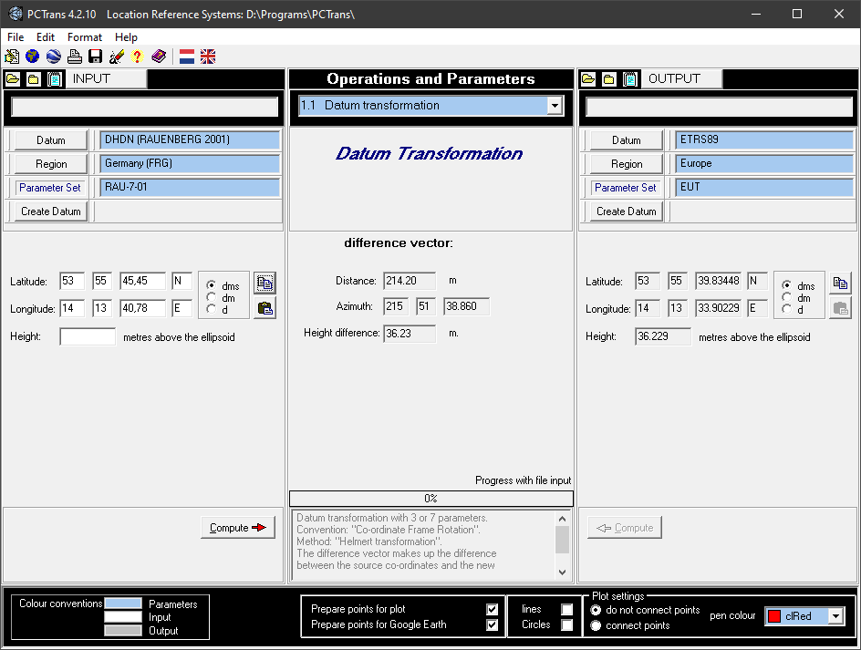

# System Rauenberg

Alternatywne nazwy: DHDN, Potsam Datum  
Oznaczenia: RAU-7-01, Zone 5, Central meridian 15°E, DHDN RAUENBERG 2001

## Odwzorowanie Gaussa-Krugera

Parametr                         | Wartość
--------------------------------:|--------
Projection                       | TRANSVERSE  
Zunits                           | No  
Units                            | Meters  
Ellipsoid                        | Bessel 1841  
scale factor at central meridian | 1.000000
longitude of central meridian    | 15°00'00"
latitude of origin               | 0°00'00"
false easting (meters)           | 5500000.00
false northing (meters)          | 0.00

## Parametry transformacji Rauenberg → ETS89

Parametr                         | Wartość
--------------------------------:|--------
xAxisTranslation                 | 598.1  
yAxisTranslation                 | 73.7
zAxisTranslation                 | 418.2
scaleDifference                  | 6.7
xAxisRotation                    | 0.202
yAxisRotation                    | 0.045
zAxisRotation                    | -2.455

***

### Literatura

- http://gdz.bkg.bund.de/web_koordtrans/start.html
- http://www.killetsoft.de/p_trdu_e.htm
- https://upd.geodatenzentrum.de/geodaten/gdz?gdz_spr=eng&l=coord
- http://sgs.geodatenzentrum.de/coordtrans/
- http://mapref.org/MapProjectionsDE.html
