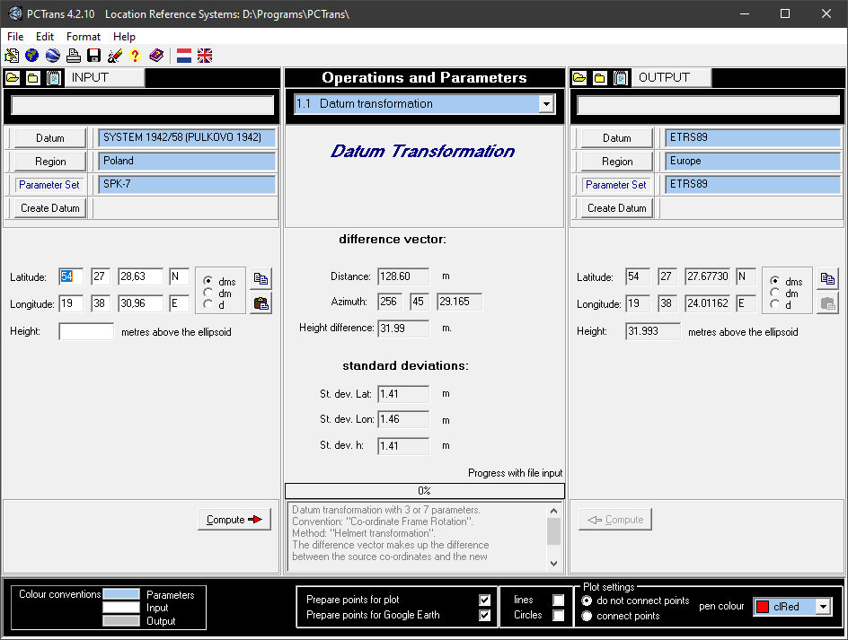

# System S-42

Alternatywne nazwy: Elipsoida Krasowskiego, Pułkowo, 1942, SK-42  
Oznaczenia: SYSTEM 1942/58, POLAND SPK-7

System obowiązujący w krajach b. Układu Warszawskiego, wprowadzony po raz pierwszy w roku 1942 z b. ZSRR, zaś w Polsce w latach 50-tych. Globalny układ współrzędnych geodezyjnych definiowała elipsoida Krasowskiego z punktem przyłożenia do geoidy w "sali okrągłej" obserwatorium astronomicznego w Pułkowie i lokalną orientacją azymutem na Bugry. Układ odniesienia został zrealizowany poprzez wzajemne powiązanie osnów podstawowych państw układu. W oparciu o tak zrealizowany układ odniesienia i elipsoidę Krasowskiego wprowadzono w Polsce państwowe układy kartograficzne: najpierw układ 1942, a następnie pięciostrefowy układ 1965 (funkcjonujacy aktualnie dla map wielkoskalowych), a także układ GUGIK-80 dla map przeglądowych.  
*Źródło: [ASG-EUPOS](http://www.asgeupos.pl/index.php?wpg_type=tech_rf&sub=u1942)*

