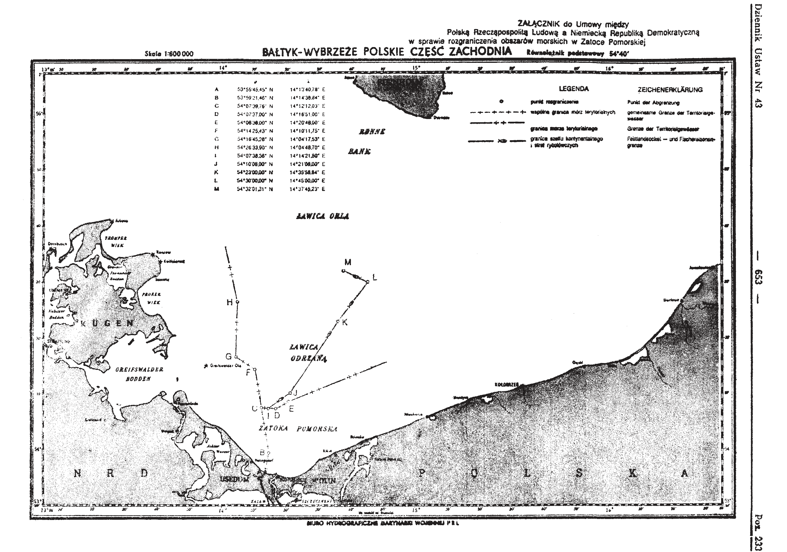
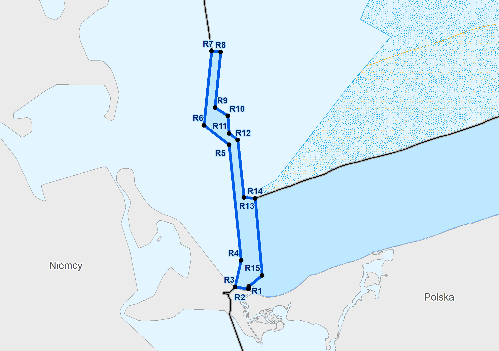
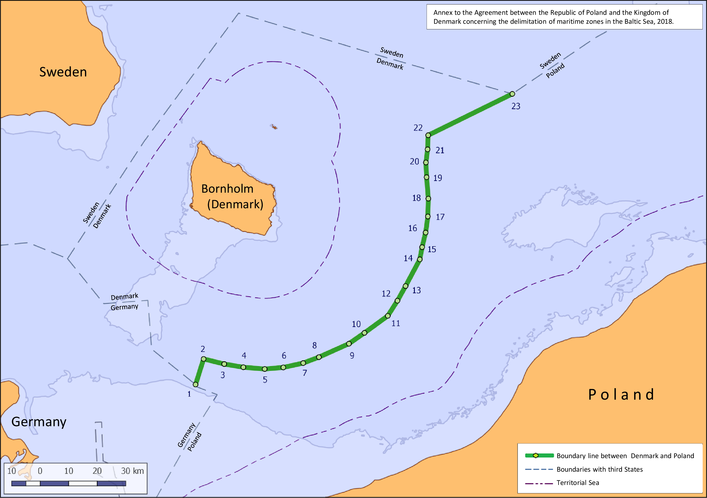
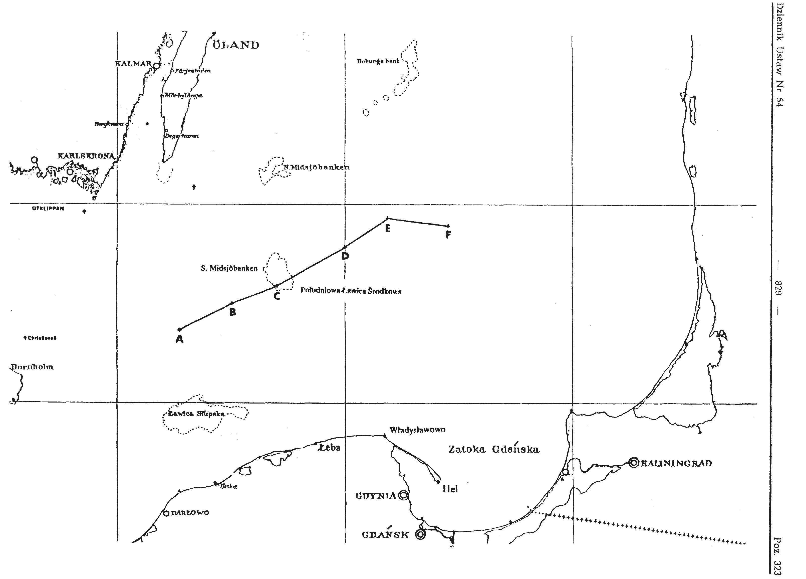
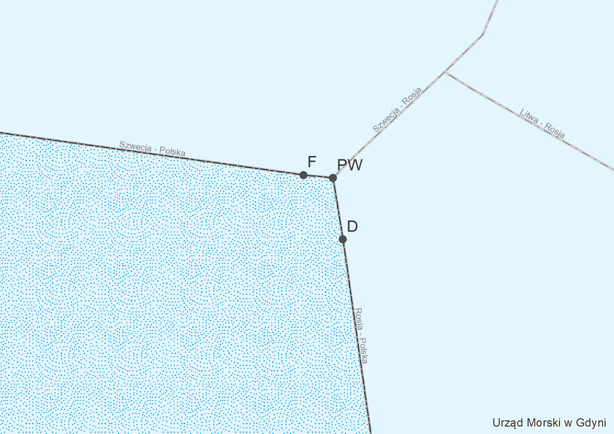
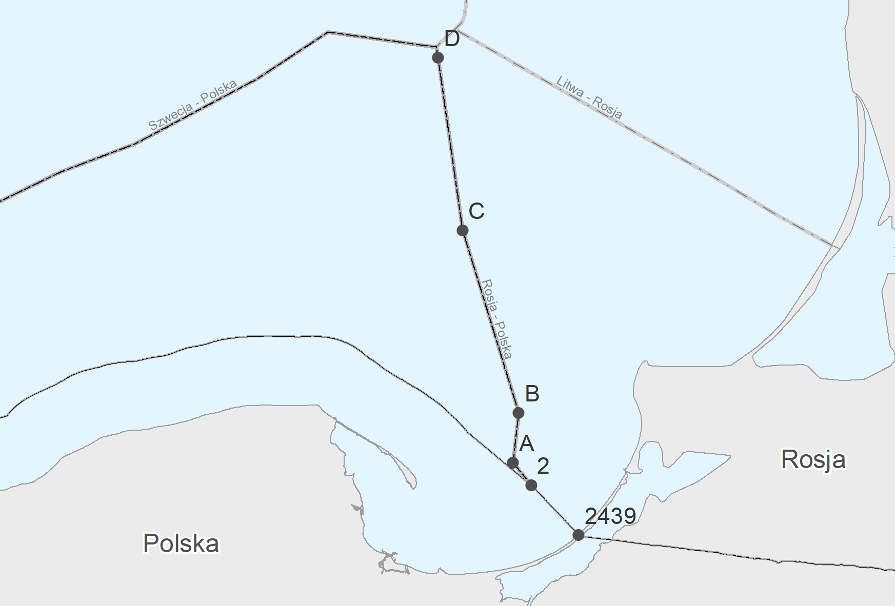
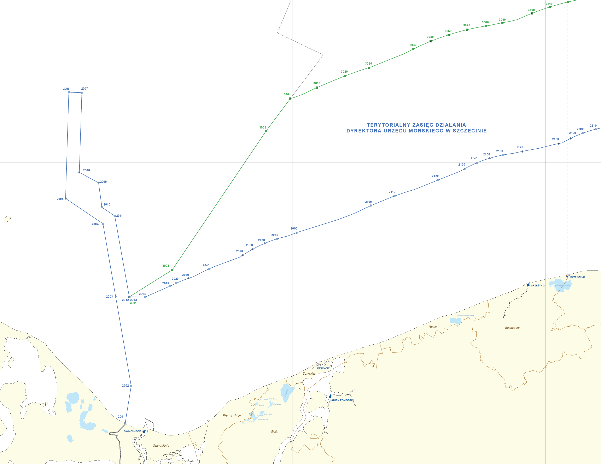

# Polskie granice morskie

Przeliczenie współrzędnych załamania granicy wyłącznej strefy ekonomicznej oraz innych
granic morskich.

***

## Polska - Niemcy

### Umowa między Polską Rzecząpospolitą Ludową a Niemiecką Republiką Demokratyczną w sprawie rozgraniczenia obszarów morskich w Zatoce Pomorskiej, podpisana w Berlinie dnia 22 maja 1989 r.

[Dz.U. 1989 nr 43 poz. 233](http://prawo.sejm.gov.pl/isap.nsf/DocDetails.xsp?id=WDU19890430233)  
Źródłowy układ odniesienia: System [Rauenberg](Docs/Reauenberg/) (art. 7).

 |  Nr   | φRauenberg | λRauenberg | φETRS89 | λETRS89 |
 | :---: | :-------------------: | :-------------------: | :----------------: | :----------------: |
 |   A   |     53°55'45.45"      |     14°13'40.78"      |    53°55'39.83"    |    14°13'33.90"    |
 |   B   |     53°59'21.46"      |     14°14'38.84"      |    53°59'15.82"    |    14°14'31.95"    |
 |   C   |     54°07'39.76"      |     14°12'12.03"      |    54°07'34.06"    |    14°12'05.14"    |
 |   D   |     54°07'37.00"      |     14°16'51.00"      |    54°07'31.31"    |    14°16'44.07"    |
 |   E   |     54°08'38.00"      |     14°20'48.00"      |    54°08'32.30"    |    14°20'41.03"    |
 |   F   |     54°14'25.43"      |     14°10'11.75"      |    54°14'19.68"    |    14°10'04.87"    |
 |   G   |     54°16'45.28"      |     14°04'17.53"      |    54°16'39.51"    |    14°04'10.70"    |
 |   H   |     54°26'33.90"      |     14°04'48.70"      |    54°26'28.07"    |    14°04'41.85"    |
 |   I   |     54°07'38.36"      |     14°14'21.80"      |    54°07'32.66"    |    14°14'14.89"    |
 |   J   |     54°10'08.00"      |     14°21'08.00"      |    54°10'02.29"    |    14°21'01.02"    |
 |   K   |     54°23'00.00"      |     14°35'58.84"      |    54°22'54.21"    |    14°35'51.70"    |
 |   L   |     54°30'00.00"      |     14°45'00.00"      |    54°29'54.17"    |    14°44'52.76"    |
 |   M   |     54°32'01.31"      |     14°37'45.23"      |    54°31'55.46"    |    14°37'38.05"    |
  

***

&nbsp;

  
### Rozporządzenie Rady Ministrów z dnia 22 lutego 1995 r. w sprawie ustalenia granicy redy dla portów morskich w Świnoujściu i Szczecinie

[Dz.U. 1995 nr 20 poz. 101](http://prawo.sejm.gov.pl/isap.nsf/DocDetails.xsp?id=WDU19950200101)  
Źródłowy układ odniesienia: W rozporządzeniu nie podano układu odniesienia. Na podstawie porównania
współrzędnych z Dz.U.89.43.233 można stwierdzić, że jest to System [Rauenberg](Docs/Reauenberg/).

|  Nr   | φRauenberg | λRauenberg | φETRS89 | λETRS89 |
| :---: | :-------------------: | :-------------------: | :----------------: | :----------------: |
|  R1   |     53°55'40.65"      |     14°16'44.88"      |    53°55'35.04"    |    14°16'37.97"    |
|  R2   |     53°55'39.00"      |     14°16'42.00"      |    53°55'33.39"    |    14°16'35.09"    |
|  R3   |     53°55'48.00"      |     14°13'42.00"      |    53°55'42.38"    |    14°13'35.12"    |
|  R4   |     53°59'21.46"      |     14°14'38.84"      |    53°59'15.82"    |    14°14'31.95"    |
|  R5   |     54°14'25.43"      |     14°10'11.75"      |    54°14'19.68"    |    14°10'04.87"    |
|  R6   |     54°16'45.28"      |     14°04'17.53"      |    54°16'39.51"    |    14°04'10.70"    |
|  R7   |     54°26'33.90"      |     14°04'48.70"      |    54°26'28.07"    |    14°04'41.85"    |
|  R8   |     54°26'31.66"      |     14°06'51.98"      |    54°26'25.83"    |    14°06'45.11"    |
|  R9   |     54°19'10.05"      |     14°06'28.21"      |    54°19'04.27"    |    14°06'21.36"    |
|  R10  |     54°18'12.00"      |     14°09'30.00"      |    54°18'06.23"    |    14°09'23.12"    |
|  R11  |     54°15'56.00"      |     14°10'02.00"      |    54°15'50.24"    |    14°09'55.12"    |
|  R12  |     54°15'07.88"      |     14°12'03.74"      |    54°15'02.13"    |    14°11'56.84"    |
|  R13  |     54°07'38.36"      |     14°14'21.80"      |    54°07'32.66"    |    14°14'14.89"    |
|  R14  |     54°07'37.00"      |     14°16'51.00"      |    54°07'31.31"    |    14°16'44.07"    |
|  R15  |     53°57'34.00"      |     14°19'33.00"      |    53°57'28.38"    |    14°19'26.06"    |
|  R16  |     53°55'59.94"      |     14°16'47.61"      |    53°55'54.32"    |    14°16'40.70"    |
|  R17  |     53°55'59.96"      |     14°16'46.02"      |    53°55'54.34"    |    14°16'39.11"    |

&nbsp;
> Transformajca układów współrzędnych
> - Źródłowy układ współrzędnych przyjęty w rozporządzeniu: [Rauenberg](Docs/Reauenberg/)
> - Docelowy układ współrzędnych: [ETRS89](Docs/ETRS89/)
> - Obliczenia wykonano za pomocą programu [PCTrans](Docs/PCTrans/) 4.2.10.
> - Metoda transformacji: Helmert Bursa-Wolf (siedmioparametrowa)

&nbsp;

***

## Polska - Dania

### Umowa między Rzecząpospolitą Polską a Królestwem Danii w sprawie rozgraniczenia obszarów morskich na Morzu Bałtyckim, podpisana w Brukseli dnia 19 listopada 2018 r.

[Dz.U. 2019 poz. 1240](http://prawo.sejm.gov.pl/isap.nsf/DocDetails.xsp?id=WDU20190001240)  
[Dz.U. 2019 poz. 1241](http://prawo.sejm.gov.pl/isap.nsf/DocDetails.xsp?id=WDU20190001241)  
Źródłowy układ odniesienia: [ETRS89](Docs/ETRS89/)

 |  Nr   | φETRS89 | λETRS89 |
 | :---: | :----------------: | :----------------: |
 |   1   |    54°32'08.19"    |    14°38'08.28"    |
 |   2   |    54°36'51.00"    |    14°41'25.00"    |
 |   3   |    54°35'34.00"    |    14°47'58.00"    |
 |   4   |    54°34'40.00"    |    14°54'05.00"    |
 |   5   |    54°34'00.00"    |    15°00'58.00"    |
 |   6   |    54°34'00.00"    |    15°07'02.00"    |
 |   7   |    54°34'28.00"    |    15°13'37.00"    |
 |   8   |    54°35'20.00"    |    15°18'52.00"    |
 |   9   |    54°37'20.00"    |    15°29'01.00"    |
 |  10   |    54°39'06.00"    |    15°34'23.00"    |
 |  11   |    54°41'54.00"    |    15°42'27.00"    |
 |  12   |    54°44'33.00"    |    15°46'03.00"    |
 |  13   |    54°47'09.00"    |    15°49'11.00"    |
 |  14   |    54°51'57.00"    |    15°54'41.00"    |
 |  15   |    54°54'11.00"    |    15°55'49.00"    |
 |  16   |    54°56'52.00"    |    15°57'27.00"    |
 |  17   |    54°59'51.00"    |    15°58'42.00"    |
 |  18   |    55°03'11.00"    |    15°59'27.00"    |
 |  19   |    55°07'15.00"    |    15°59'34.00"    |
 |  20   |    55°10'01.00"    |    15°59'50.00"    |
 |  21   |    55°12'28.00"    |    16°00'50.00"    |
 |  22   |    55°15'06.10"    |    16°01'30.00"    |
 |  23   |    55°21'13.64"    |    16°30'38.17"    |

&nbsp;
> Transformajca układów współrzędnych
> - Źródłowy układ współrzędnych przyjęty w umowe: [ETRS89](Docs/ETRS89/)
> - Docelowy układ współrzędnych: taki sam jak układ źródłowy ([ETRS89](Docs/ETRS89/))

&nbsp;

***

## Polska - Szwecja

### Umowa w sprawie rozgraniczenia szelfu kontynentalnego i stref rybołówczych między Polską Rzecząpospolitą Ludową a Królestwem Szwecji, sporządzona w Warszawie dnia 10 lutego 1989 r.

[Dz.U. 1989 nr 54 poz. 323](http://prawo.sejm.gov.pl/isap.nsf/DocDetails.xsp?id=WDU19890540323)  
Źródłowy układ odniesienia: [WGS72](Docs/WGS72/)

|  Nr   | φWGS72 | λWGS72 | φETRS89 | λETRS89 |
| :---: | :---------------: | :---------------: | :----------------: | :----------------: |
|   A   |    55°21.640'     |    16°32.000'     |    55°21'38.49"    |    16°32'00.55"    |
|   B   |    55°30.000'     |    17°00.000'     |    55°30'00.09"    |    17°00'00.55"    |
|   C   |    55°35.235'     |    17°22.680'     |    55°35'14.19"    |    17°22'41.35"    |
|   D   |    55°46.985'     |    18°00.000'     |    55°46'59.19"    |    18°00'00.55"    |
|   E   |    55°55.293'     |    18°21.800'     |    55°55'17.67"    |    18°21'48.55"    |
|   F   |    55°52.876'     |    18°54.000'     |    55°52'52.65"    |    18°54'00.55"    |

&nbsp;
> Transformajca układów współrzędnych
> - Źródłowy układ współrzędnych przyjęty w rozporządzeniu: [WGS72](Docs/WGS72/)  
> - Docelowy układ współrzędnych: [ETRS89](Docs/ETRS89/)
> - Obliczenia wykonano za pomocą programu [PCTrans](Docs/PCTrans/) 4.2.10.
> - Metoda transformacji: Helmert Bursa-Wolf (siedmioparametrowa)

&nbsp;

***

## Polska - Szwecja - Rosja

### Umowa między Rządem Polskiej Rzeczypospolitej Ludowej, Rządem Królestwa Szwecji i Rządem Związku Socjalistycznych Republik Radzieckich w sprawie wspólnego punktu rozgraniczenia obszarów morskich na morzu Bałtyckim, podpisana w Sztokholmie dnia 30 czerwca 1990 r.

[Dz.U. 1990 nr 74 poz. 441](http://prawo.sejm.gov.pl/isap.nsf/DocDetails.xsp?id=WDU19900740441)  
Źródłowy układ odniesienia: [WGS72](Docs/WGS72/)

|  Nr   | φWGS72 | λWGS72 | φETRS89 | λETRS89 |
| :---: | :---------------: | :---------------: | :----------------: | :----------------: |
|  PW   |    55°52.788'     |    18°55.645'     |    55°52'47.37"    |    18°55'33.25"    |

&nbsp;
> Transformajca układów współrzędnych
> - Źródłowy układ współrzędnych przyjęty w rozporządzeniu: [WGS72](Docs/WGS72/)
> - Docelowy układ współrzędnych: [ETRS89](Docs/ETRS89/)
> - Obliczenia wykonano za pomocą programu [PCTrans](Docs/PCTrans/) 4.2.10.
> - Metoda transformacji: Helmert Bursa-Wolf (siedmioparametrowa)

&nbsp;

***

## Polska - Rosja

### Umowa między Polską Rzecząpospolitą Ludową a Związkiem Socjalistycznych Republik Radzieckich o rozgraniczeniu morza terytorialnego (wód terytorialnych), strefy ekonomicznej, strefy rybołówstwa morskiego i szelfu kontynentalnego na Morzu Bałtyckim, podpisana w Moskwie dnia 17 lipca 1985 r.

[Dz.U. 1986 nr 16 poz. 85](http://prawo.sejm.gov.pl/isap.nsf/DocDetails.xsp?id=WDU19860160085)  
Źródłowy układ odniesienia: [S-42](Docs/WGS72/) (Elipsoida Krassowskiego)

|  Nr   | φS-42 | λS-42 | φETRS89 | λETRS89 |
| :---: | :--------------: | :--------------: | :----------------: | :----------------: |
| 2439  |   54°27'28.63"   |   19°38'30.96"   |    54°27'27.68"    |    19°38'24.01"    |
|   2   |    54°36'15"     |    19°24'22"     |    54°36'14.04"    |    19°24'15.02"    |
|   A   |    54°40'12"     |    19°18'54"     |    54°40'11.04"    |    19°18'47.01"    |
|   B   |    54°48'54"     |    19°20'42"     |    54°48'53.04"    |    19°20'34.98"    |
|   C   |    55°20'48"     |    19°03'48"     |    55°20'47.05"    |    19°03'40.87"    |
|   D   |    55°51'00"     |    18°56'12"     |    55°50'59.06"    |    18°56'04.77"    |

&nbsp;
> Transformajca układów współrzędnych
> - Źródłowy układ współrzędnych przyjęty w rozporządzeniu: [S-42](Docs/S42/)
> - Docelowy układ współrzędnych: [ETRS89](Docs/ETRS89/)
> - Obliczenia wykonano za pomocą programu [PCTrans](Docs/PCTrans/) 4.2.10
> - Metoda transformacji: Helmert Bursa-Wolf (siedmioparametrowa)

&nbsp;

***

## Przebieg linii podstawowej, granicy morza terytorialnego, granicy strefy przyległej

### Rozporządzenie Rady Ministrów z dnia 13 stycznia 2017 r. w sprawie szczegółowego przebiegu linii podstawowej, zewnętrznej granicy morza terytorialnego oraz zewnętrznej granicy strefy przyległej Rzeczypospolitej Polskiej

[Dz.U. 2017 poz. 183](http://prawo.sejm.gov.pl/isap.nsf/DocDetails.xsp?id=WDU20170000183)  
Źródłowy układ odniesienia: [PL-ETRF89](Docs/PL-ETRF89/)

&nbsp;

#### Linia podstawowa

 |  Nr   | φPL-ETRF89 | λPL-ETRF89 |
 | :---: | :-------------------: | :-------------------: |
 | 1001  |     53°55'49.288"     |     14°13'36.441"     |
 | 1002  |     53°55'26.500"     |     14°14'58.900"     |
 | 1003  |     53°55'27.000"     |     14°16'21.500"     |
 |  ...  |          ...          |          ...          |
 | 1166  |     54°27'32.949"     |     19°38'15.554"     |

» [Wkaz współrzędnych linii podstawowej](Data/Dz.U.2017.183-LP.txt)  
» [Mapa 1](Data/Dz.U.2017.183_LP-UMSzczecni.pdf), [Mapa 2](Data/Dz.U.2017.183_LP-UMSlupsk.pdf), [Mapa 3](Data/Dz.U.2017.183_LP-UMGdynia.pdf)

&nbsp;

#### Morze terytorialne

 |  Nr   | φPL-ETRF89 | λPL-ETRF89 |
 | :---: | :-------------------: | :-------------------: |
 | 2001  |     53°55'49.288"     |     14°13'36.441"     |
 | 2002  |     53°59'15.82"      |     14°14'31.95"      |
 | 2003  |     54°07'34.06"      |     14°12'05.14"      |
 |  ...  |          ...          |          ...          |
 | 2902  |     54°27'32.949"     |     19°38'15.554"     |

» [Wkaz współrzędnych granicy morza terytorialnego](Data/Dz.U.2017.183-MT.txt)  
» [Mapa 1](Data/Dz.U.2017.183_MT-SP-UMSzczecni.pdf), [Mapa 2](Data/Dz.U.2017.183_MT-SP-UMSlupsk.pdf), [Mapa 3](Data/Dz.U.2017.183_MT-SP-UMGdynia.pdf)

&nbsp;

#### Strefa przyległa

 |  Nr   | φPL-ETRF89 | λPL-ETRF89 |
 | :---: | :-------------------: | :-------------------: |
 | 3001  |     54°07'32.80"      |     14°14'15.27"      |
 | 3002  |     54°10'02.29"      |     14°21'01.02"      |
 | 3003  |     54°22'54.21"      |     14°35'51.70"      |
 |  ...  |          ...          |          ...          |
 | 3804  |     54°36'14.04"      |     19°24'15.02"      |

» [Wkaz współrzędnych granicy strefy przyległej](Data/Dz.U.2017.183-SP.txt)  
» [Mapa 1](Data/Dz.U.2017.183_MT-SP-UMSzczecni.pdf), [Mapa 2](Data/Dz.U.2017.183_MT-SP-UMSlupsk.pdf), [Mapa 3](Data/Dz.U.2017.183_MT-SP-UMGdynia.pdf) 

&nbsp;
> Transformajca układów współrzędnych
> - Źródłowy układ współrzędnych przyjęty w umowe: [PL-ETRF89](Docs/PL-ETRF89/)
> - Docelowy układ współrzędnych: [ETRS89](Docs/ETRS89/) (tożsamy z układem źródłowym)

&nbsp;

***

Transformacja układów współrzędnych została wykonana w 2016 roku 
przez Andrzeja Bielskiego z [Biura Hydrograficznego Marynarki Wojennej](https://bhmw.gov.pl)
przy współpracy z Jakubem Szostakiem z [Urzędu Morskiego w Gdyni](https://www.umgdy.gov.pl/)
oraz Kamilem Rybką z [Ministerstwa Gospodarki Morskiej i Żeglugi Śródlądowej](https://mgm.gov.pl).